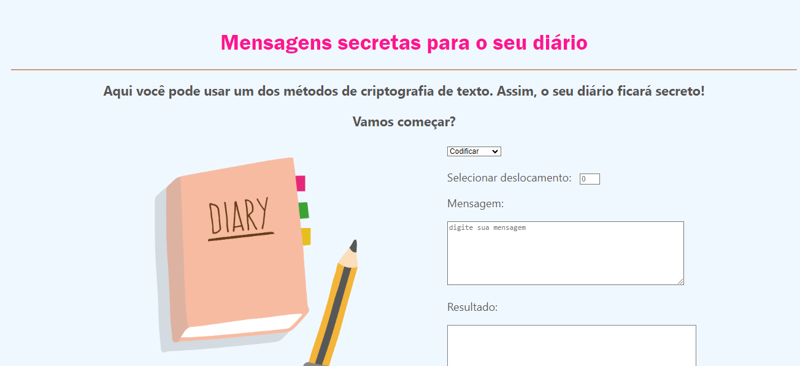

# Mantendo seu Diário em segredo

Você já sonhou em fazer o seu próprio diário? 
Essa aplicação permite que o usuário codifique ou descodifique mensagens, para serem colocadas em seu diário, assim, nenhum curiso vai bisbilhotar seus segredos. 

Esse foi o primeiro projeto da Laboratória a ser elaborado. 

## Índice

* [1.Sobre-o-projeto](#1-sobre-o-projeto)
* [2.Instruções](#instruções)
* [3.Interface](#3-interface)
* [4.Linguagem Utilizadas](#4-Linguagem-utilizada)

***

## 1. Sobre o projeto

Através da aplicação "Mensagens secretas para o seu diário", o usuário poderar ter a segurança de obter mensagens secretas para aplicar em seu diário, online, ou até mesmo fisico. A cifra de Cesar é um dos primeiros tipos de criptografias conhecidas na história. O imperador romano Júlio César utilizava essa cifra para enviar ordens secretas aos seus generais no campo de batalha.

A cifra de César é uma das técnicas mais simples de cifrar uma mensagem. É um
tipo de cifra por substituição, em que cada letra do texto original é
substituida por outra que se encontra há um número fixo de posições
(deslocamento) mais a frente do mesmo alfabeto.

Por exemplo se usarmos o deslocamento (_offset_) de 3 posições:

* Alfabeto sem cifrar: A B C D E F G H I J K L M N O P Q R S T U V W X Y Z
* Alfabeto com cifra:  D E F G H I J K L M N O P Q R S T U V W X Y Z A B C
* A letra A será D
* A palavra CASA será FDVD

Atualmente todas as cifras de substituição alfabética simples, são decifradas
com facilidade e não oferecem muita segurança na comunicação por si mesma,
mas a cifra de César muitas vezes pode fazer parte de um sistema
mais complexo de criptografia, como
a cifra de Vigenère, e tem aplicação no sistema ROT13.

## 2. Interface

Nessa aplicação, o usuário poderá cifrar e decifrar um texto no navegador indicando um deslocamento
específico de caracteres.

Dessa forma, ele pode aplicar em seu diário para ele ficar secreto. 

Ao topo a interface possui informações básicas e relevantes da cifra de césar, e instruções diretas para que o usuário selecione a opção que deseja (códificar ou descodificar), emitindo as mensagens. conforme se verifica:

## 3. Linguaguens utilizadas

HTML| CSS3| JavaScript

Feito por Gabriella Vieira Bruno. 

